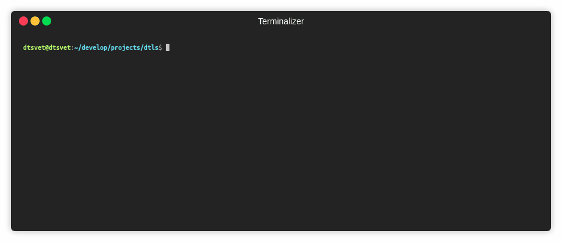

# @nodertc/dtls

[](https://github.com/emersion/stability-badges#experimental)
[](https://travis-ci.org/nodertc/dtls)
[](https://www.npmjs.com/package/@nodertc/dtls)
[](https://www.npmjs.com/package/@nodertc/dtls)
[](https://www.npmjs.com/package/@nodertc/dtls)
[](https://www.npmjs.com/package/@nodertc/dtls)
[](https://gitter.im/nodertc/community)

Secure UDP communications using Datagram Transport Layer Security protocol version 1.2 in **pure js**. Follow [RFC6347](https://tools.ietf.org/html/rfc6347), [RFC7627](https://tools.ietf.org/html/rfc7627).

[](https://asciinema.org/a/195096)

### Support

[](https://www.buymeacoffee.com/reklatsmasters)

### Features

* **no native dependecies!**
* modern secure ciphers (by default)
* in-out fragmentation / in-out retransmission
* merge outgoing handshakes

### Usage

```
npm i @nodertc/dtls
```

```js
const dtls = require('@nodertc/dtls');

const socket = dtls.connect({
  type: 'udp4',
  remotePort: 4444,
  remoteAddress: '127.0.0.1',
});

socket.on('error', err => {
  console.error(err);
});

socket.on('data', data => {
  console.log('got message "%s"', data.toString('ascii'));
  socket.close();
});

socket.once('connect', () => {
  socket.write('Hello from Node.js!');
});
```

### Suppored ciphers:

* TLS_ECDHE_ECDSA_WITH_CHACHA20_POLY1305_SHA256 (_nodejs v11.2+ only_)
* TLS_ECDHE_RSA_WITH_CHACHA20_POLY1305_SHA256 (_nodejs v11.2+ only_)
* TLS_ECDHE_ECDSA_WITH_AES_128_GCM_SHA256
* TLS_ECDHE_ECDSA_WITH_AES_256_GCM_SHA384
* TLS_ECDHE_RSA_WITH_AES_128_GCM_SHA256
* TLS_ECDHE_RSA_WITH_AES_256_GCM_SHA384
* TLS_RSA_WITH_AES_128_GCM_SHA256
* TLS_RSA_WITH_AES_256_GCM_SHA384
* TLS_PSK_WITH_CHACHA20_POLY1305_SHA256 (_nodejs v11.2+ only_)
* TLS_PSK_WITH_AES_128_GCM_SHA256
* TLS_PSK_WITH_AES_256_GCM_SHA384
* TLS_ECDHE_PSK_WITH_AES_128_GCM_SHA256
* TLS_ECDHE_PSK_WITH_AES_256_GCM_SHA384
* TLS_ECDHE_PSK_WITH_CHACHA20_POLY1305_SHA256

### API

* `dtls.connect(options: Options [, callback: function]) : Socket`

Creates an esteblished connection to remote dtls server. A `connect()` function also accept all options for [`unicast.createSocket()`](https://www.npmjs.com/package/unicast) or [`dgram.createSocket()`](https://nodejs.org/dist/latest-v8.x/docs/api/dgram.html#dgram_dgram_createsocket_options_callback). If `options.socket` is provided, these options will be ignored.

The `callback` function, if specified, will be added as a listener for the 'connect' event.

* `options.socket`

A [duplex stream](https://nodejs.org/api/stream.html#stream_class_stream_duplex) in a common case. It is also [unicast](https://www.npmjs.com/package/unicast) or [dgram](https://nodejs.org/dist/latest-v8.x/docs/api/dgram.html) socket instance. Used if you want a low level control of your connection.

* `options.extendedMasterSecret: bool, [default=true]`

This option enable the use [Extended Master Secret](https://tools.ietf.org/html/rfc7627) extension. Enabled by default.

* `options.checkServerIdentity: function(certificate): bool`

Optional certificate verify function.

* `options.certificate: Buffer`

PEM-encoded client certificate, optional. Supports RSASSA-PKCS1-v1_5 and ECDSA certificates.

* `options.certificatePrivateKey: Buffer`

PEM-encoded private key for client certificate.

* `options.maxHandshakeRetransmissions: number`

The number of retransmissions during on handshake stage.

* `options.alpn: string | string[]`

The list of the supported ALPN protocols.
* `options.pskIdentity: String|Buffer`

Identity string for PSK key exchange, see [RFC4279](https://tools.ietf.org/html/rfc4279).

* `options.pskSecret: String|Buffer`

Secret data for the identity string of PSK key exchange.

* `options.ignorePSKIdentityHint: boolean, default=true`

Both clients and servers may have pre-shared keys with several different parties.  The client indicates which key to use by including a "PSK identity" (_see `options.pskIdentity` above_) in the ClientKeyExchange message. To help the client in selecting which identity to use, the server can provide a "PSK identity hint" in the ServerKeyExchange message.

* `options.cipherSuites: number[]|string[]`

List of supported by client cipher suites. Default cipher suites:
  - TLS_ECDHE_ECDSA_WITH_CHACHA20_POLY1305_SHA256 (_in nodejs v11+ only_)
  - TLS_ECDHE_RSA_WITH_CHACHA20_POLY1305_SHA256 (_in nodejs v11+ only_)
  - TLS_ECDHE_ECDSA_WITH_AES_128_GCM_SHA256
  - TLS_ECDHE_ECDSA_WITH_AES_256_GCM_SHA384
  - TLS_ECDHE_RSA_WITH_AES_128_GCM_SHA256
  - TLS_ECDHE_RSA_WITH_AES_256_GCM_SHA384

See above a full list of supported cipher suites.

* `class Socket`

A `Socket` is also a [duplex stream](https://nodejs.org/api/stream.html#stream_class_stream_duplex), so it can be both readable and writable, and it is also a [EventEmitter](https://nodejs.org/api/events.html#events_class_eventemitter).

* `Socket.setMTU(mtu: number): void`

Set MTU (minimal transfer unit) for this socket, 1420 bytes maximal.

* `Socket.getMTU(): number`

Return MTU (minimal transfer unit) for this socket, 1200 bytes by default.

* `Socket.setTimeout(timeout: number[, callback: function()])`

Sets the socket to timeout after timeout milliseconds of inactivity on the socket. By default `dtls.Socket` do not have a timeout.

The optional callback parameter will be added as a one-time listener for the 'timeout' event.

* `Socket.close(): void`

Close socket, stop listening for socket. Do not emit `data` events anymore.

* `Socket.alpnProtocol: string`

Get a string that contains the selected ALPN protocol.

* `Event: connect`

The 'connect' event is emitted after the handshaking process for a new connection has successfully completed.

* `Event: timeout`

Emitted if the socket times out from inactivity. This is only to notify that the socket has been idle.

* `dtls.constants: Object`
  - `cipherSuites: Object`
  A full list supported cipher suites. See above for detailes.

### How to debug?

Start dtls server:

```sh
docker run -it --name dtlsd --rm -e "GNUTLS_DEBUG_LEVEL=2" -e "PRIORITY=NORMAL:+AEAD:+ECDHE-RSA:+VERS-DTLS1.2" -e "KEYFILE=key-rsa.pem" -e "CERTFILE=cert-rsa.pem" -p 4444:4444/udp nodertc/dtls-server:1
```

Start default client:

```sh
npm start
```

## License

MIT, 2018 - 2019 &copy; Dmitriy Tsvettsikh
