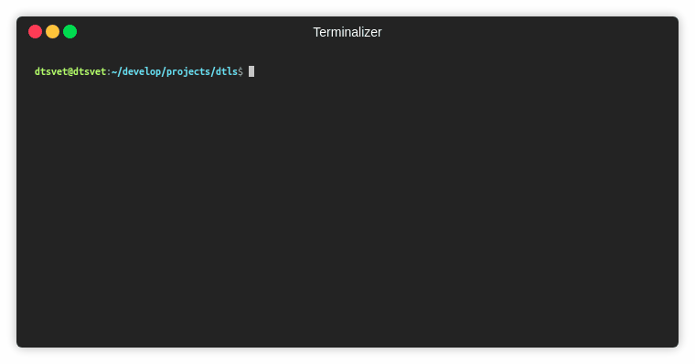

# @nodertc/dtls

[](https://travis-ci.org/nodertc/dtls)
[](https://www.npmjs.com/package/@nodertc/dtls)
[](https://www.npmjs.com/package/@nodertc/dtls)
[](https://www.npmjs.com/package/@nodertc/dtls)
[](https://www.npmjs.com/package/@nodertc/dtls)

Datagram Transport Layer Security Version 1.2 in pure js. Follow [RFC6347](https://tools.ietf.org/html/rfc6347).

[](https://asciinema.org/a/195096)


### Suppored ciphers:

* TLS_RSA_WITH_AES_128_GCM_SHA256
* TLS_RSA_WITH_AES_256_GCM_SHA384

### Usage

```
npm i @nodertc/dtls
```

```js
const dtls = require('@nodertc/dtls');

const socket = dtls.connect({
  remotePort: 4444,
  remoteAddress: '127.0.0.1',
});

socket.on('error', err => {
  console.error(err);
});

socket.on('data', data => {
  console.log('got message "%s"', data.toString('ascii'));
  socket.close();
});

socket.once('connect', () => {
  socket.write('Hello from Node.js!');
});
```

### How to debug?

Start openssl dtls server:

```sh
npm run openssl-server
```

or start GnuTLS dtls server (more debug messages):

```sh
# tested in Ubuntu 16, use docker if you are Windows / MacOS user.
npm run gnutls-server
```

Start default client:

```sh
npm start
```

## TODO

* [ ] handle reordered handshake messages
* [ ] set MTU and outgoing fragmentation
* [ ] set ALPN
* [ ] server
* [ ] handle rehandshake
* [ ] heartbleat extension

## Lincense

MIT, 2018 &copy; Dmitriy Tsvettsikh
